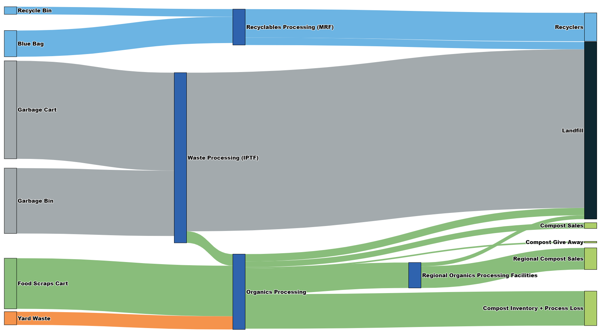

# Problem and Urgency for our Project

## 1. edmonton_waste_2022.csv (https://data.edmonton.ca/stories/s/Residential-Waste-Material-Movement-at-EWMC/66wa-it35/)

- The purpose of this dataset is to show the residential collected waste processed at the Edmonton Waste Management Centre (EWMC) and regional processors (i.e. recyclables and organics).

## 2. ECCC 2022 (https://www.canada.ca/en/environment-climate-change/services/environmental-indicators/solid-waste-diversion-disposal.html)

In 2022, Canada disposed of 26.6 million tonnes of waste, the highest amount ever recorded. This was a 1.91% increase from 2020. 

Waste breakdown 
- Residential waste: 10.7 million tonnes, a decline from 2018
- Non-residential waste: 15.9 million tonnes, an increase from 2010

Waste diversion 
- 27.1% of solid waste was diverted in 2022
- The remaining 72.9% was sent for disposal in landfills or incinerated

Waste sources 
- Non-residential waste comes from commercial operations, institutional facilities, and construction, demolition, and manufacturing
- Residential waste includes non-hazardous waste that is picked up by the municipality or taken to disposal sites by the household

Waste generation 
- Canada generates more municipal waste per capita than most of its peer countries
- Factors that contribute to increased waste generation include urbanization, consumption patterns, household income, and lifestyles

Plastic waste
- Canada has a Zero Plastic Waste Initiative to reduce plastic pollution 
- Marine litter, much of which is plastic, can harm wildlife, damage habitats, and impact fisheries 